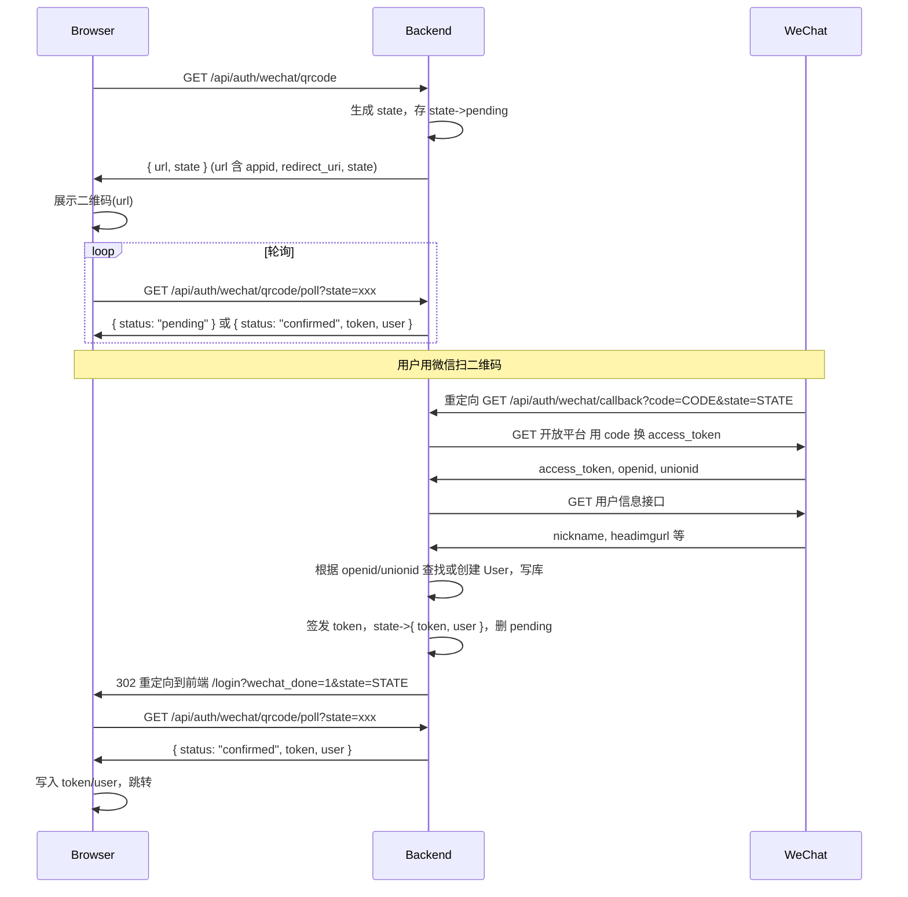

# 真实微信扫码登录 — 技术设计

## Context

- 当前 GET /api/auth/wechat/qrcode 返回 { url: null }；POST /api/auth/wechat 接受 { code, platform } 但用 mock 数据返回，未调微信接口、未写库。
- 前端 PC 登录页：请求 qrcode → 若有 url 则展示并轮询 GET /auth/wechat/qrcode/poll，期望返回 { status, token?, user? }，status=confirmed 时写入 token 并跳转。
- User 表已有 wechat_open_id（唯一）、wechat_union_id（可选唯一）、nickname、avatar_url；会话为前端持有 token、后端无状态校验或 Redis 白名单（按现有实现）。

## 目标流程（PC 扫码）

## 设计决策

### 1. Admin 配置项

- 在 system-config（或统一「第三方接入」）中新增：
  - `wechat_open_app_id`：微信开放平台「网站应用」AppID，明文。
  - `wechat_open_app_secret`：AppSecret，仅写入与掩码展示（与现有 API 密钥策略一致）；存储层可明文或加密，不暴露给前端与日志。
- 读取方式：Auth 模块依赖 SystemConfigService（或 ConfigService），在生成 qrcode URL 与回调处理时读取；若未配置则 GET qrcode 返回 { url: null, state: null }，前端保持「暂未开启扫码登录」。

### 2. 扫码 URL 与 state

- 开放平台文档：`https://open.weixin.qq.com/connect/qrconnect?appid=APPID&redirect_uri=REDIRECT_URI&response_type=code&scope=snsapi_login&state=STATE#wechat_redirect`
- redirect_uri：后端回调地址，如 `https://<api-domain>/api/auth/wechat/callback`，需在微信开放平台应用后台配置为授权回调域/回调地址。
- state：后端生成随机字符串（如 UUID），与「待确认」状态绑定；回调时校验并防重放。
- GET /api/auth/wechat/qrcode 返回：`{ url: string | null, state: string | null }`。当未配置 AppID 或 AppSecret 时 url 为 null。

### 3. 临时状态存储（state → 结果）

- 需求：生成 qrcode 时记录 state 为 pending；回调成功后写入该 state 对应的 token 与 user；轮询时根据 state 返回 pending 或 confirmed + token + user，并在返回 confirmed 后删除该 state（一次性消费）。
- 实现：内存 Map 或 Redis。Key = state，Value = { status: 'pending' } 或 { status: 'confirmed', token, user }；TTL 建议 5–10 分钟，避免长期占用。
- 若用内存：多实例需粘性会话或改为 Redis，否则回调与轮询可能打到不同实例；单实例可先内存 Map。

### 4. 回调接口 GET /api/auth/wechat/callback

- 接收 query：code、state（微信重定向带回）。
- 校验：state 存在于本地存储且为 pending；code 非空。
- 请求微信：`GET https://api.weixin.qq.com/sns/oauth2/access_token?appid=APPID&secret=SECRET&code=CODE&grant_type=authorization_code`，得到 access_token、openid、unionid 等。
- 若需昵称头像：再请求微信「获取用户信息」接口（需 scope 含 snsapi_userinfo；网站应用 snsapi_login 是否含用户信息以文档为准，必要时申请 scope）。
- 用户写入：Prisma 查 User 表 by wechat_open_id；不存在则 create（wechat_open_id、wechat_union_id、nickname、avatar_url 等）；存在则 update 昵称/头像（可选）。
- 签发 token：与现有 loginWithPassword 一致（如 JWT 或随机 token 存 Redis），格式与前端期望一致（token + user 对象）。
- 写回 state 存储：state → { status: 'confirmed', token, user }；删除或覆盖 pending。
- 响应：302 重定向到前端登录页，如 `https://<front-domain>/login?wechat_done=1&state=STATE`，不在 URL 中带 token（由轮询取）。

### 5. 轮询接口 GET /api/auth/wechat/qrcode/poll

- Query：state（必填）。
- 若 state 不存在或已过期：返回 200 { status: 'expired' } 或 404。
- 若为 pending：返回 200 { status: 'pending' }。
- 若为 confirmed：返回 200 { status: 'confirmed', token, user }，并删除该 state（仅返回一次）。

### 6. 会话与用户信息

- Token：与现有逻辑统一（如 JwtAuthGuard 校验、或 Redis 校验），不在此变更改会话模型。
- User：已存在 Prisma User 表；wechat_open_id 必填且唯一；unionid 可选；昵称头像可选更新。首次扫码即创建 User，后续扫码即更新并登录。

### 7. 公众号 JS SDK（可选，本变更可仅预留）

- 场景：H5 在微信内打开时，使用公众号 JS SDK（wx.login）获取 code，前端将 code 发后端，后端用**公众号** appid/secret 换 token 与用户信息（与开放平台为不同应用）。
- Admin 可再增配置：wechat_mp_app_id、wechat_mp_app_secret（公众号）；后端 POST /api/auth/wechat 的 payload 可带 platform: 'h5' | 'pc_qrcode'，h5 时用公众号接口换 token。
- 本设计不展开 JS SDK 前端具体调用（wx.config、wx.ready、wx.login），仅约定后端需支持用「公众号 code」换 token 与用户信息，并在 Admin 中可配置公众号 AppID/Secret。

## 风险与依赖

- 微信开放平台应用需审核通过，并配置授权回调域为后端域名。
- 多实例部署时 state 存储须集中（Redis），否则回调与轮询可能不一致。
- AppSecret 存储：若系统无统一密钥加密，可先存明文于后端配置，仅保证不返给前端与不写日志。

## 实现顺序建议

1. Admin：新增 wechat_open_app_id、wechat_open_app_secret 配置项与表单（Secret 掩码）。
2. 后端：WeChat 开放平台 HTTP 封装（换 code、拉用户信息）；state 存储（内存或 Redis）；GET qrcode（生成 url+state）；GET callback（换 code、写 User、写 state、302）；GET poll（按 state 返回）。
3. 前端：LoginView 使用 url+state，轮询 poll 直至 confirmed，写 token/user 并跳转。
4. 可选：公众号 code 换 token 接口 + Admin 公众号配置 + 前端 H5 内 wx.login 传 code。
